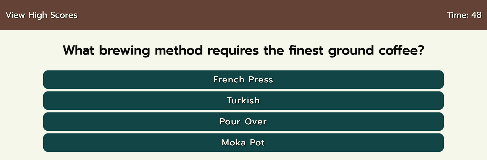

# pokemon-quiz

## Description

This is a simple quiz app made with HTML, CSS, and Javascript. The final score is
determined by how many seconds the player has left. The player is docked 10 points for
each wrong answer. All high scores are stored with browser's local storage, and there
is an external page where the scores can be viewed.

## Usage

[Deployed Site](https://hope428.github.io/pokemon-quiz/index.html)
[Github Repo](https://github.com/hope428/pokemon-quiz)

## Credits

Followed [this tutorial](https://www.w3schools.com/js/js_window_location.asp) for page redirects 

Reference for localStorage [by Michael Karén](https://michael-karen.medium.com/how-to-save-high-scores-in-local-storage-7860baca9d68)

## Features

This project featuers a timer element using setInterval. The time is used to determine
the player's score, as well as only allowing the player to continue if time is remaining.

Another feature of this project is the high scores list. It is stored in local storage and 
can be cleared at any time.

Media queries are also featured to give this page a good mobile layout

